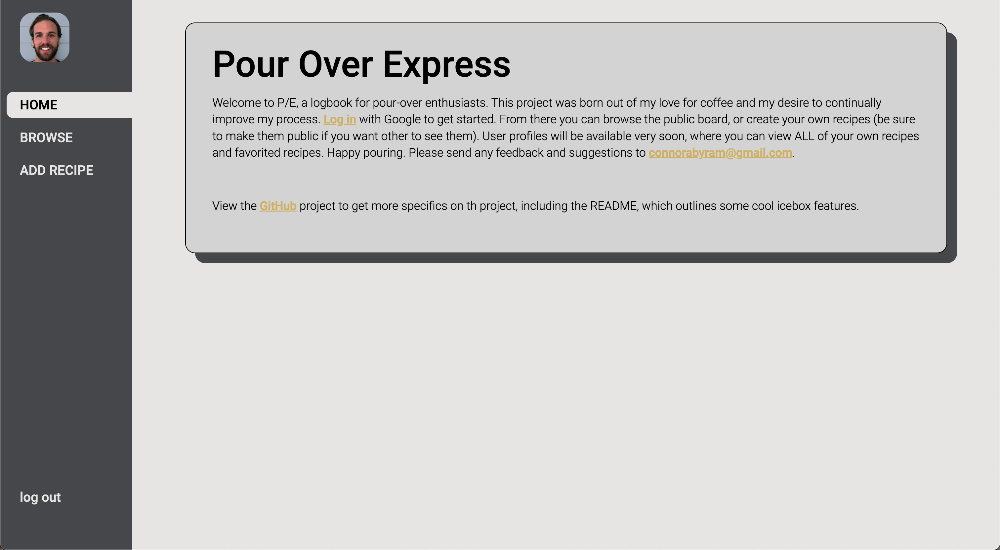
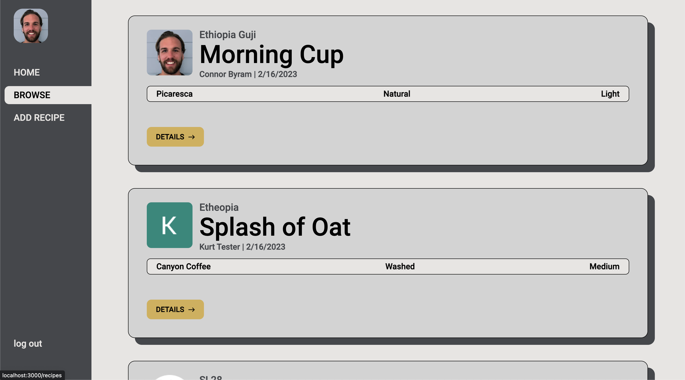
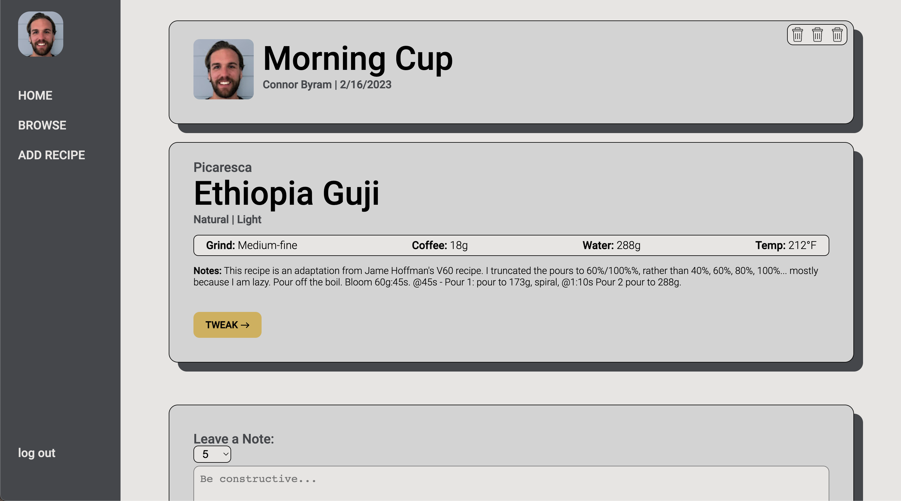
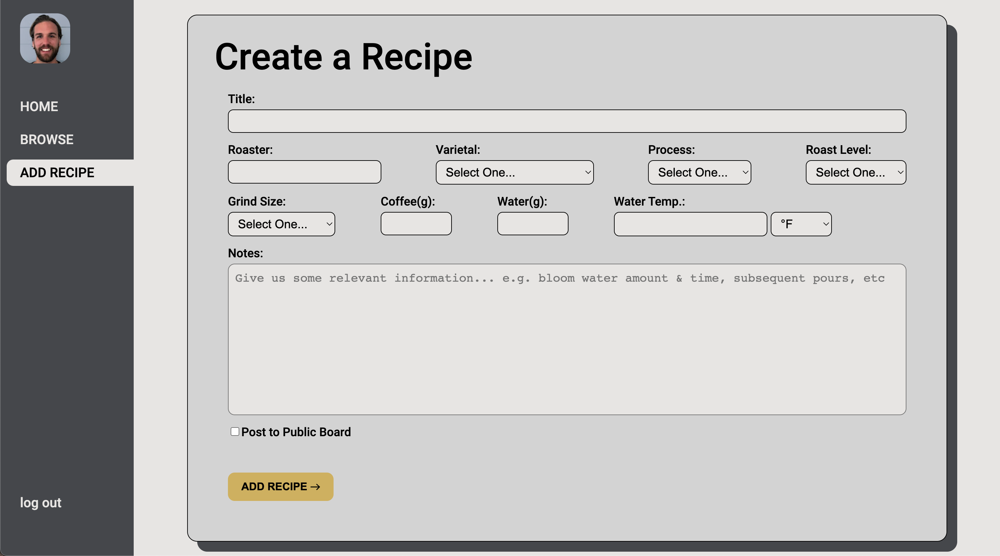

 # Pour Over Express

  ## Introduction

Welcome to P/E, a logbook for pour-over enthusiasts. This project was born out of my love for coffee and my desire to continually improve my process. 

This app allows you to log your own pour-over recipes as well as view and rate other users' recipes. There are a lot of exciting updates to come, so stay tuned!

 

## Screen Shots  

 

## Technologies
##### Ideation & Design
  
  
  

##### Development
  

  
  
  

  
  

##### Data
  
  

##### Deployment
  
  
  

 

## Getting Started

[Deploy App](https://pour-over-express.herokuapp.com/)

[View Project Planning](https://trello.com/b/qDd1G8fX/pour-over-express)

 

## Next Steps

- Mobile optimization
- Add a recipe to a favorites list
- User pages that show user-created recipes and favorited recipes
- Branching funtionality that allows you to copy/edit another user's recipe
- Timer/Recipe functionality that guides you through the steps of a recipe
- Sort recipes by Bean Varietal, Roast Level, Avg. Rating, and Roaster

 